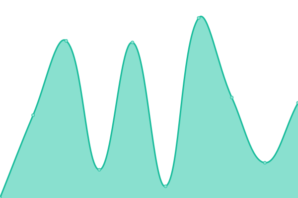

# [📈 Live Status](https://ashish-khokhar.github.io): <!--live status--> **🟩 All systems operational**

This repository contains the open-source uptime monitor and status page for [Ashish Khokhar](ashishkhokhar.com), powered by [Upptime](https://github.com/upptime/upptime).

With [Upptime](https://upptime.js.org), you can get your own unlimited and free uptime monitor and status page, powered entirely by a GitHub repository. We use [Issues](https://github.com/ashish-khokhar/services-status/issues) as incident reports, [Actions](https://github.com/ashish-khokhar/services-status/actions) as uptime monitors, and [Pages](https://ashish-khokhar.github.io) for the status page.

<!--start: status pages-->
<!-- This summary is generated by Upptime (https://github.com/upptime/upptime) -->
<!-- Do not edit this manually, your changes will be overwritten -->
<!-- prettier-ignore -->
| URL | Status | History | Response Time | Uptime |
| --- | ------ | ------- | ------------- | ------ |
|  Web | 🟩 Up | [web.yml](https://github.com/ashish-khokhar/services-status/commits/HEAD/history/web.yml) | 

 286ms
     
 | 

<a href="https://ashish-khokhar.github.io/services-status/history/web">100.00%</a>
    

|  Home | 🟩 Up | [home.yml](https://github.com/ashish-khokhar/services-status/commits/HEAD/history/home.yml) | 

 444ms
     
 | 

<a href="https://ashish-khokhar.github.io/services-status/history/home">98.91%</a>
    

|  [Plex](http://home.ashishkhokhar.com:32400/) | 🟩 Up | [plex.yml](https://github.com/ashish-khokhar/services-status/commits/HEAD/history/plex.yml) | 

 403ms
     
 | 

<a href="https://ashish-khokhar.github.io/services-status/history/plex">98.92%</a>
    

|  [KMS](kms.ashishkhokhar.com) | 🟩 Up | [kms.yml](https://github.com/ashish-khokhar/services-status/commits/HEAD/history/kms.yml) | 

 194ms
     
 | 

<a href="https://ashish-khokhar.github.io/services-status/history/kms">98.93%</a>
    

|  [Jellyfin](https://jellyfin.home.ashishkhokhar.com/web/) | 🟩 Up | [jellyfin.yml](https://github.com/ashish-khokhar/services-status/commits/HEAD/history/jellyfin.yml) | 

 757ms
     
 | 

<a href="https://ashish-khokhar.github.io/services-status/history/jellyfin">100.00%</a>
    

<!--end: status pages-->

[**Visit our status website →**](https://ashish-khokhar.github.io)

## 📄 License

- Powered by: [Upptime](https://github.com/upptime/upptime)
- Code: [MIT](./LICENSE) © [Ashish Khokhar](ashishkhokhar.com)
- Data in the `./history` directory: [Open Database License](https://opendatacommons.org/licenses/odbl/1-0/)
